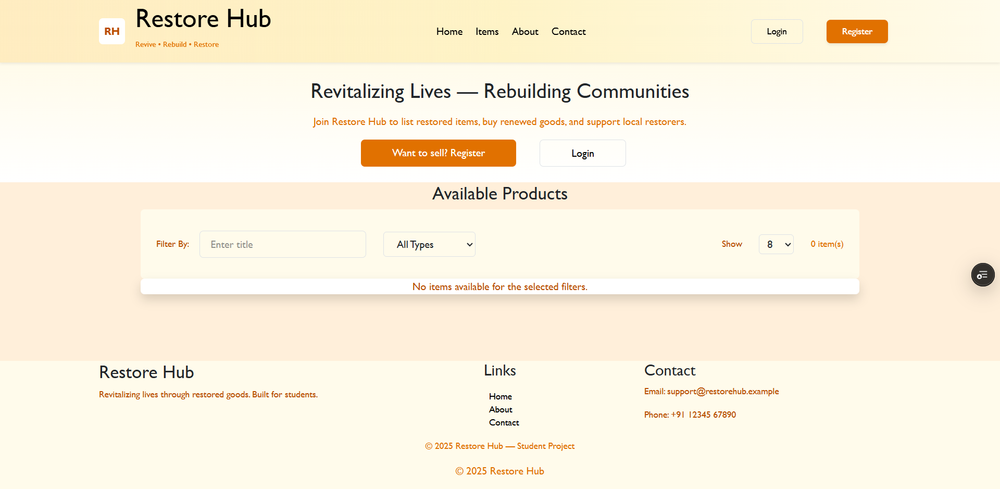
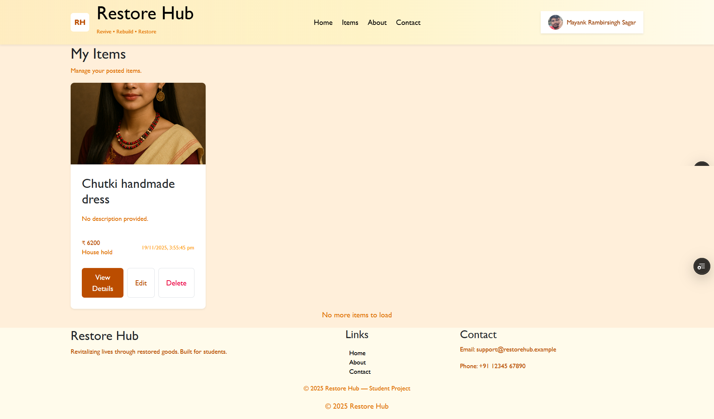
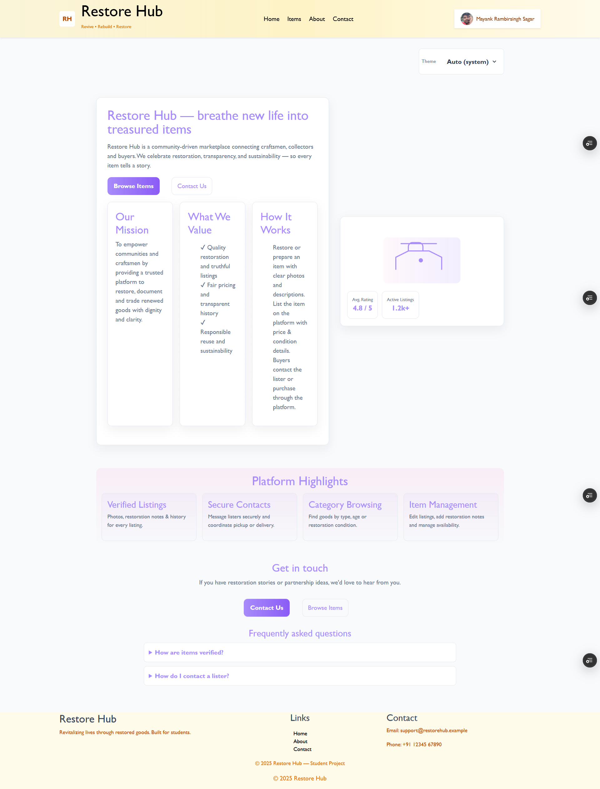
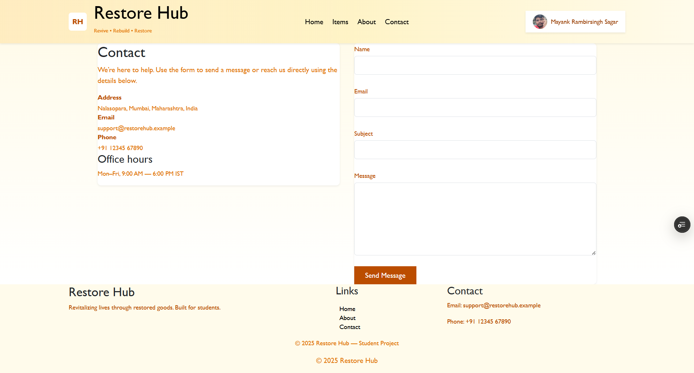
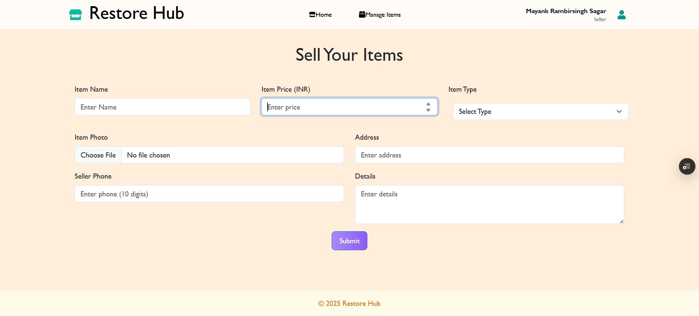
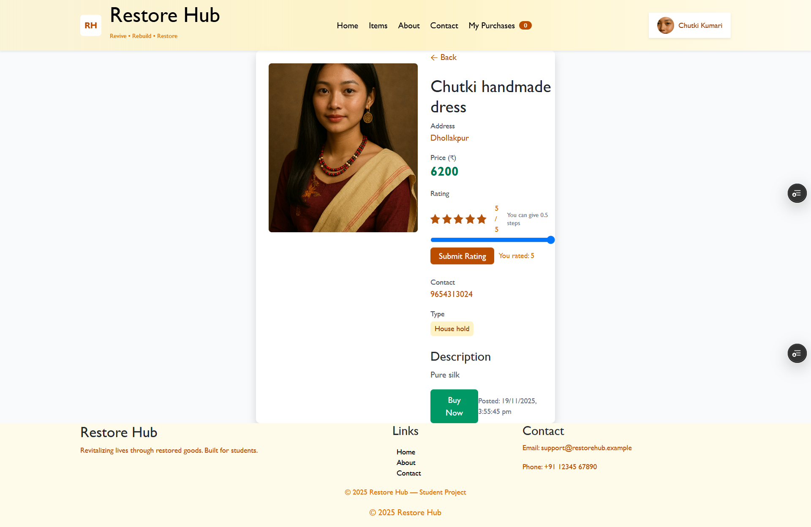
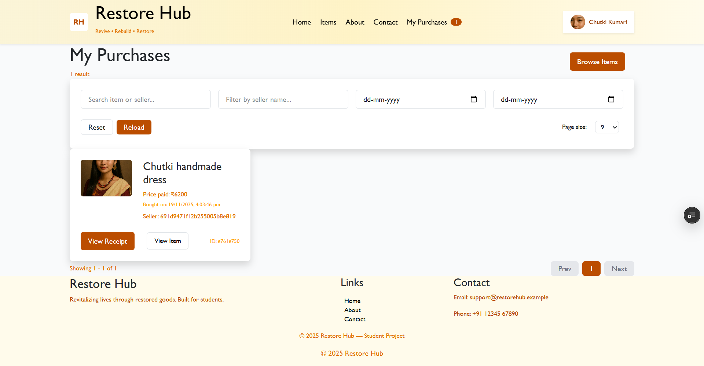

Here is a **professional, complete, production-ready README.md** for your GitHub project **Restore Hub** — fully customized for your stack, features, deployment links, architecture, and usage.

You can copy-paste this directly into your repo:

---

# 🚀 Restore Hub — Full-Stack Restoration Marketplace

### Revitalizing Lives — Rebuilding Communities

**Live App:** [https://restore-hub-eight.vercel.app](https://restore-hub-eight.vercel.app)
**Backend API:** [https://restore-hub-5v50.onrender.com](https://restore-hub-5v50.onrender.com)
**Author:** Mayank Sagar

---

# 📌 Overview

**Restore Hub** is a full-stack marketplace platform designed to help users **restore, list, discover, and rehome** pre-loved goods.
It supports both **sellers** (who restore and list items) and **buyers** (who browse, filter, and purchase restored products).

The app is built using the modern **MERN stack** with a **beautiful Tailwind UI**, full authentication, Cloudinary image storage, responsive design, and a complete seller dashboard.

This project demonstrates end-to-end full-stack development, including authentication, CRUD operations, media uploads, protected routes, API architecture, and deployment on **Render (backend)** and **Vercel (frontend)**.

---

# 🛠️ Tech Stack

### **Frontend**

- React (Vite)
- TailwindCSS
- Axios (with credentials)
- React Router
- Context API (User + Theme)
- ShadCN & custom UI components

### **Backend**

- Node.js + Express.js
- MongoDB + Mongoose
- Cloudinary (image hosting)
- Multer (memory storage)
- JWT + HttpOnly Cookies
- CORS with credentials support

### **DevOps**

- Vercel (Frontend Hosting)
- Render (Backend Hosting)
- Environment variables
- Cross-origin cookie configuration

---

# ✨ Features

### 🔐 **Authentication**

- Register, login, logout
- Secure JWT stored in HttpOnly cookies
- Auth-protected routes (frontend + backend)
- Auto-fetch user session (`/api/user/me`)

### 🛍️ **Marketplace**

- Browse all items
- Filter by title and category
- Sort, search, pagination
- View item details with images

### 🧑‍🔧 **Seller Dashboard**

- Add new restored items
- Edit items
- Delete items (including Cloudinary cleanup)
- Track all listed items

### 👤 **Buyer Features**

- Contact/login prompt
- Purchase an item
- View purchase history

### 🌤️ **UI/UX**

- Modern pastel theme
- Auto dark/light theme support
- Mobile responsive
- Polished About, Contact, Profile pages
- Reusable UI components (cards, buttons, filters, modals)

---

# 🗂️ Project Structure

```
Restore-Hub/
│
├── frontend/ (React + Vite + Tailwind)
│   ├── src/
│   │   ├── components/
│   │   ├── pages/
│   │   ├── contexts/
│   │   ├── api/
│   │   └── App.jsx
│   ├── public/
│   └── vercel.json
│
└── backend/ (Node.js + Express)
    ├── config/
    ├── controllers/
    ├── middlewares/
    ├── models/
    ├── routes/
    ├── utils/
    ├── index.js
    └── package.json
```

---

# 🔧 Setup & Installation

## 1️⃣ Clone the repository

```bash
git clone https://github.com/mayankrsagar/Restore-Hub.git
cd Restore-Hub
```

---

## 2️⃣ Install Backend Dependencies

```bash
cd backend
npm install
```

### Create `.env` file:

```
PORT=4000
MONGO_DB_URI=your_mongodb_uri
JWT_KEY=your_jwt_secret
CLOUD_NAME=your_cloudinary_name
API_KEY=your_cloudinary_api_key
API_SECRET=your_cloudinary_api_secret
FRONTEND_URL=https://restore-hub-eight.vercel.app
```

### Start backend:

```bash
npm run dev
```

---

## 3️⃣ Install Frontend Dependencies

```bash
cd ../frontend
npm install
```

### Create `.env`:

```
VITE_API_URL=https://restore-hub-5v50.onrender.com
```

### Start frontend:

```bash
npm run dev
```

---

# 🌐 Deployment

## **Frontend (Vercel)**

Make sure `vercel.json` exists:

```json
{
  "rewrites": [{ "source": "/(.*)", "destination": "/" }]
}
```

## **Backend (Render)**

Important:

- `start` script must be: `"start": "node index.js"`
- Use `process.env.PORT`
- Enable CORS with credentials:

```js
credentials: true,
origin: "https://restore-hub-eight.vercel.app",
```

---

# 📡 API Endpoints (Summary)

### **Auth**

```
POST /user/register
POST /user/login
POST /user/logout
GET  /user/me
```

### **Items**

```
POST   /api/seller/postingitem
PUT    /api/seller/edit/:id
DELETE /api/seller/delete/:id
GET    /api/user/getallitems
GET    /api/user/fetchitemdetails/:id
```

### **Orders**

```
POST /api/user/orders/buy/:itemId
GET  /api/user/orders/my
```

---

# 🧪 Testing

- Unit tests (Jest + Supertest recommended)
- Manual testing for upload flows
- Cookie authentication testing via Postman (send credentials)

---

# 📌 Roadmap (Future Enhancements)

- 🧰 Admin dashboard
- 💬 Real-time chat between buyer & seller
- 🧾 Notifications
- 💳 Payment integration (Razorpay)
- 🕵️ Advanced search + indexing
- 📦 Shipping workflow

---

# 📸 Screenshots

+-----------------------+-----------------------+
| Home | Items |
+-----------------------+-----------------------+
|  |  |
+-----------------------+-----------------------+

+---------------+---------------+
| About |
+---------------+---------------+
|  |
+---------------+---------------+

+---------------+---------------+
| Contact |
+---------------+---------------+
|  |
+---------------+---------------+

+---------------+---------------+
| Dashboard for Seller |
+---------------+---------------+
|  |
+---------------+---------------+

+---------------+---------------+
| Item Details Section |
+---------------+---------------+
|  |
+---------------+---------------+

+---------------+---------------+
| My Purchase seciton for buyer |
+---------------+---------------+
|  |
+---------------+---------------+

# 🧑‍💻 Author

**Mayank Sagar**
Full-Stack Developer (MERN, vite, Tailwind, Cloudinary, Razorpay)
🔗 LinkedIn: [https://linkedin.com/in/mayankrsagar](https://linkedin.com/in/mayankrsagar)
🔗 GitHub: [https://github.com/mayankrsagar](https://github.com/mayankrsagar)

---

# ⭐ Support

If you like this project, please ⭐ the repo — it helps others discover it!
